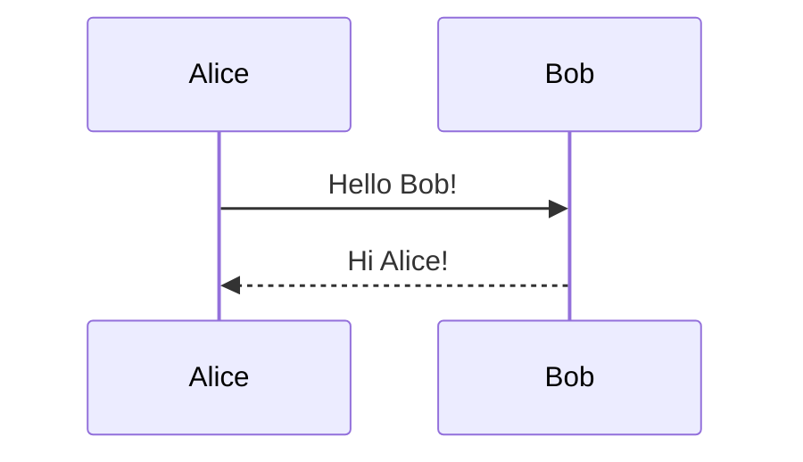

# Session Handover - Miro MCP Server

> **Date**: 2025-12-21
> **Project**: miro-mcp-server
> **Location**: `/Users/olgasafonova/go/src/miro-mcp-server`
> **Version**: v1.2.1 (development)
> **Latest Commit**: `332a8da`

---

## Current State

**50 MCP tools** for Miro whiteboard control. Phases 1-6 complete.

All tests passing. Build works.

```bash
# Verify
go build -o miro-mcp-server .
go test ./...
```

---

## Just Completed This Session

### 1. Connector List/Get Tools (+2 tools)

New tools for complete connector CRUD:

| Tool | Purpose |
|------|---------|
| `miro_list_connectors` | List all connectors on a board with pagination |
| `miro_get_connector` | Get full details of a specific connector |

Files modified:
- `miro/create.go` - Added implementations
- `miro/types_operations.go` - New types
- `miro/interfaces.go` - Updated ConnectorService
- `tools/definitions.go` - Tool specs
- `tools/handlers.go` - Handler registration

### 2. Sequence Diagram Support

Extended Mermaid parser to handle sequence diagrams:



**Supported syntax:**
- `sequenceDiagram` header
- `participant X` / `participant X as Label`
- `actor X` (renders as circle)
- `A->>B: text` (sync message, solid arrow)
- `A-->>B: text` (async message, dotted arrow)
- `A-xB: text` (lost message, cross end)
- `loop`, `alt`, `else`, `end` blocks

Files added/modified:
- `miro/diagrams/sequence.go` - NEW: Sequence parser
- `miro/diagrams/mermaid.go` - Auto-detection
- `miro/diagrams/mermaid_test.go` - 8 new tests

---

## Tool Count History

| Version | Tools | Notes |
|---------|-------|-------|
| v1.0.0 | 38 | Initial release |
| v1.1.0 | 43 | Phase 5 (audit, webhooks) |
| v1.2.0 | 44 | Phase 6 (diagram generation) |
| v1.2.1-dev | 48 | Tag/connector update/delete |
| **Current** | **50** | Connector list/get, sequence diagrams |

---

## Key Documentation

| File | Purpose |
|------|---------|
| `CLAUDE.md` | Architecture, patterns, how to add tools |
| `ROADMAP.md` | Full implementation plan and status |
| `docs/PHASE5_PLAN.md` | Phase 5 design details |

---

## What's Next? (Recommendations)

### Priority 1: Strengthen Test Coverage

Current coverage is good but could be improved:

```bash
go test -cover ./...
# Target: 80%+ coverage on miro/ package
```

Areas to add tests:
- Integration tests with mock HTTP server
- Edge cases in sequence diagram parser
- Error handling paths in connector operations

### Priority 2: Additional Diagram Types

The parser architecture supports extension:

| Diagram Type | Complexity | Value |
|--------------|------------|-------|
| Class diagrams | Medium | High (developers) |
| State diagrams | Medium | High (product teams) |
| ER diagrams | High | Medium |
| Gantt charts | High | Medium |

### Priority 3: Performance & Polish

- Add benchmarks for diagram parsing/layout
- Profile memory usage for large boards
- Improve error messages with suggestions
- Add `--verbose` flag for debugging

### Priority 4: New Capabilities

| Feature | API Available? | Notes |
|---------|---------------|-------|
| Item comments | **No** | Not in Miro REST API v2 |
| Board templates | Yes | `POST /v2/boards` with `from_template` |
| Presentation mode | No | Not exposed via API |
| Advanced search | Partial | Can filter by type, tags |

### Priority 5: Release Prep

For v1.3.0 release:
1. Update README with sequence diagram examples
2. Add CHANGELOG.md entry
3. Tag and push release
4. Update any package managers

---

## Architecture Summary

```
miro-mcp-server/
├── main.go                 # Entry point
├── miro/
│   ├── client.go           # HTTP client with retry/caching
│   ├── interfaces.go       # All service interfaces (12 interfaces)
│   ├── boards.go           # Board operations
│   ├── items.go            # Item CRUD
│   ├── create.go           # Create operations + connector list/get
│   ├── diagrams.go         # Diagram generation
│   ├── diagrams/           # Mermaid parsers + layout
│   │   ├── mermaid.go      # Flowchart parser + auto-detect
│   │   ├── sequence.go     # Sequence diagram parser (NEW)
│   │   ├── layout.go       # Sugiyama-style algorithm
│   │   └── converter.go    # Diagram → Miro items
│   ├── audit/              # Audit logging
│   ├── oauth/              # OAuth 2.1 + PKCE
│   └── webhooks/           # Webhook subscriptions
└── tools/
    ├── definitions.go      # Tool specs (50 tools)
    ├── handlers.go         # Handler registration
    └── mock_client_test.go # Mock for testing
```

---

## Quick Reference

```bash
# Build
go build -o miro-mcp-server .

# Run (stdio)
MIRO_ACCESS_TOKEN=xxx ./miro-mcp-server

# Run (HTTP with webhooks)
MIRO_ACCESS_TOKEN=xxx MIRO_WEBHOOKS_ENABLED=true ./miro-mcp-server -http :8080

# Test
go test ./...

# Test with coverage
go test -cover ./...

# Test specific package
go test ./miro/diagrams/... -v
```

---

## Known Limitations

1. **Comments API**: Miro REST API v2 does not expose comments. This is a community-requested feature.

2. **Sequence diagram layout**: Currently places participants horizontally but messages use connector positioning (may need visual adjustment for complex sequences).

3. **Enterprise features**: Export jobs require Enterprise plan.

---

## Competitive Position

| Server | Tools | Diagram Gen | Sequence | Language |
|--------|-------|-------------|----------|----------|
| **This server** | 50 | Flowchart + Sequence | ✅ | Go |
| k-jarzyna/miro-mcp | 87 | ❌ | ❌ | TypeScript |
| Official Miro MCP | ~10 | Flowchart only | ❌ | TypeScript |

**Unique advantages:**
- Only Go-based Miro MCP (single binary, fast)
- Sequence diagram support
- Full connector CRUD
- Rate limiting + caching built-in
- Voice-optimized tool descriptions
